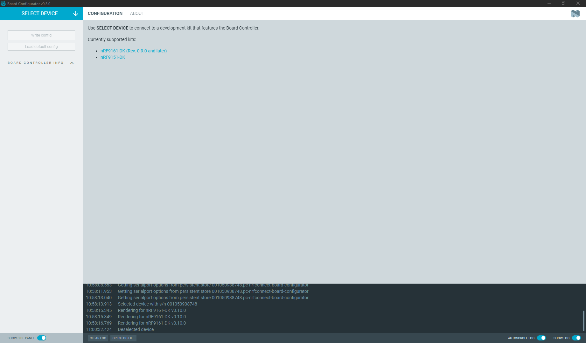

# Overview and user interface

After starting Board Configurator, the main application window is displayed.

The available options and information change after you **Select Device**.

## Select Device

Opens the drop-down with the list of devices connected to the computer. You can choose a device from the list of connected devices to perform further actions on the device such as configuring.

## Actions

When you select a device, the following actions become available in the side panel:

- **Write config** - Writes the selected configurations to the development kit.

## Configuration tab

In the **Configuration** tab, you can see the options that are configurable for the selected development kit.

## Log

The Log panel allows you to view the most important log events, tagged with a timestamp. Each time you open the app, a new session log file is created. You can find the Log panel and its controls, below the main application Window.

- When troubleshooting, to view more detailed information than shown in the Log panel, use **Open log file** to open the current log file in a text editor.
- To clear the information currently displayed in the Log panel, use **Clear Log**. The contents of the log file are not affected.
- To hide or display the Log panel in the user interface, use **Show Log**.
- To freeze Log panel scrolling, use **Autoscroll Log**.

## About tab

You can view application information, restore defaults, access source code, and documentation. You also can find information on the selected device, access support tools, and enable verbose logging.